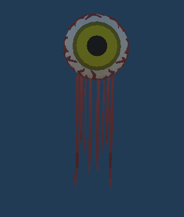
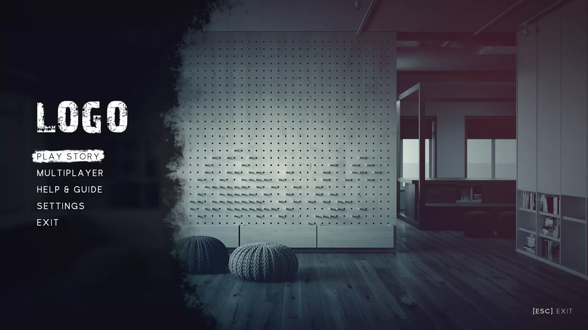
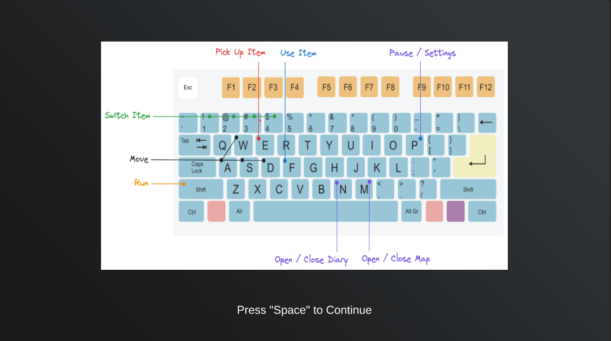

# **Game Design**

## **Game Overview:**

### **Core concept:**

This is a horror game in which the player should hide from the attack of the devil and try to find three gems to prevent the village from being massacred within the time limit of 5 minutes. 

### **Genre:**

This is an exploration-horror game. Some parts of the game were firstly inspired by horror games such as Hungry Lamu, and a lot of unique features were added to differentiate our game from other horror games. 

### **Target Audience:**

The target audience is those who will be attracted by horror games, puzzle games, and mystery stories. 

### **Unique Selling Points:**

Mystery stories with tense and oppressive atmospheres and interesting, innovative, and enjoyable puzzles will be the most attractive selling point.

## **Story and Narrative:**

### **Backstory:**

#### **Before the game starts:**

You are a child living in a village, people here are peaceful and friendly. But one day, suddenly your parents and everyone else in the village want to kidnap you and sacrifice you to devils. They take you to a ritual field inside a dark forest near the village and then tie you to a stake. You break free of villagers' restraint and escape. After a long time running, you are so tired that you gradually lapse into unconsciousness. When you wake up, the noise from villagers vanishes and you want to find a way out. You try to escape but find there is some dark mist around the forest that stops you from going out. There is light coming from the deep part of the forest, and you decide to go there to find a way out. 

#### **The main part of the game:**

You reach the light, see a ritual field in the deep part of the forest, and think it might relate to that terrifying sacrifice. A notebook that belongs to someone unknown lies on the ground and records what happened to the village during the previous few days. Clues about this disaster and how to dispel devils to save the village from massacre are taken down in that notebook. Suddenly, there is some strange sound near you, and you see some scary devils that are running towards you. 

After escaping from the attack of devils, the diaries in the notebook guide you to three unusual puzzles at different positions in the forest. You find there are some patterns behind those patterns and you can get a gemstone after decoding each pattern. The memory of an old tale comes into your head. It tells a story that a long time ago, a village was attacked by devils coming out from hell. Many villagers believed lies of devils that sacrifice a child could save the lives of the whole village. The kid escaped and zealots of devils were slaughtered by devils. Finally, before dawn, a hero with three gems came to the village, left them on the ritual field, and dispelled devils back to hell.

You followed instructions on the diary and pieces of paper found along the way and solved puzzles one by one. With the notes you find, you gradually gain a clear idea about what happened. You find one gemstone after each puzzle and after solving all the puzzles, you are able to get three gemstones to end this disaster.

#### **The ending:**

If you manage to find the three gems and place them correctly in the ritual field, you'll banish the devils back to hell and protect the village from their wrath, just like the hero from the old legend. However, if you run out of time and don't position the gems, the devils will awaken and wreak havoc on the villagers.

## **Characters:**

The protagonist is a young child residing in a village. He is the only human in the game. Alone in the forest, he is surrounded by monstrous creatures. They are different types of enemies: ghosts, flying eyes, and demon's will. Each of these adversaries can inflict harm, so evading their attacks is crucial.

Characters models: 

#### **Main character:**

The main character of the game.

#### Ghost:

The ghosts are placed on the road from the center of the map to Puzzle 3 to stop you from going to Puzzle 3. It flies toward the player when a player is near it and stays still when loses track of the player. It can go through the trees as it is a ghost!

#### Flying Eye:

The flying eyes are placed inside the forest between the center of the map and Puzzle 2 to stop you from going to Puzzle 2. It charges toward the player when the player is near it and stays still when loses track of the player. It can not go through trees but its maximum speed is faster than the ghost.

#### Demon's Will:

There is only one demon's will on the map. It will always be chasing you and can go through trees. It is considered as the biggest threat. In the beginning, its speed is very slow, but it will become faster and faster as time passes and eventually becomes faster than the player's sprint speed. If the player survives for 5 minutes but still have not finished the game, it will get super fast, ignore all obstacle, and be immune to freezing, so it acts as an end-game mechanic.

## **Gameplay and Mechanics:**

### **Player Perspective:**

This game will adopt a 3D third-person perspective, inspired by "Don't Starve". The camera will be positioned overhead, providing a bird's-eye view centered on the protagonist. However, for specific events, the camera's focus and angle will adjust accordingly.

### **Controls:**

The control of this game follows the most common design.

| Key            | Action                    |
| -------------- | ------------------------- |
| W, Arrow up    | Move forward              |
| A, Arrow left  | Move left                 |
| D, Arrow right | Move right                |
| S, Arrow down  | Move backward             |
| Shift          | Sprint                    |
| Space, LMB     | Next dialogue             |
| E              | Interact                  |
| F              | Use item                  |
| N              | Open and close notebook   |
| M              | Open and close map        |
| P              | Pause and resume the game |
| 1              | Prepare to use item 1     |
| 2              | Prepare to use item 2     |
| 3              | Prepare to use item 3     |
| 4              | Prepare to use item 4     |

**We decided to delete the camera rotation, there are several reasons:**

1. The camera's rotation introduces significant complexity to the coding, especially when adjusting 2D images and text elements to align with the camera's direction. This adds a substantial workload, could lead to unforeseen bugs, and necessitates extensive optimization.
2. If the viewing angle isn't consistent, the player might easily become disoriented and lose their way as the direction is hard to observe in the forest.
3. Similar to many games that employ isometric graphics and don't allow camera rotation, we believe this feature doesn't enhance the gameplay experience. Furthermore, we've designed the map with the current viewing angle in mind and made optimizations to ensure a seamless gameplay experience.

This was the old effect of camera rotation control,  now the camera will stick on a fixed related position to the player

The following is the current view:

- - **Progression:**

    - The player wakes up in a camp and before the game actually starts (which is after the player arrives at the central ritual field), he can get familiar with some basic game controls. There are air walls to prevent the player from leaving the road, so they must go to the central ritual first. Also, there will be an arrow pointing towards the central ritual field to tell the player he needs to go there.
    - As soon as the player arrives at the central ritual field, an animation about the player entering the ritual field will be played, and the actual game starts. This means the 5 minutes down will start counting and the demon monster will spawn and chase the player.
    - The map features three puzzles; solving each rewards the player with a gemstone. To finish the game, these gems must be positioned around a magical field at the map's center.
    - The player will face various enemy attacks, losing health points with each assault. If health reaches zero, it signifies capture by the foes, resulting in game loss and a jump scare for the player.
    - We've opted against a scoring system. The primary objective is to locate items and fend off the devils.
    - The challenge of securing all gems while evading enemies is designed to create a tense gameplay atmosphere, striking a balance between fear and enjoyment.
    - Outside of puzzle zones, a formidable enemy constantly pursues the player. It's essential to strategically use found items for evasion.

    ### **Gameplay Mechanics:**

    - The game comprises various components: the player, items that can be collected and utilized, interactive scene elements, and adversaries.
    - The player can pick up consumable items to help them escape from enemies.
    - The health bar of the player was deleted to increase the tension of the game.
    - Player capabilities include movement, sprinting, interaction with the environment, and engagement with items.
    - Enemies have the ability to track the player and attack the player.
    - At its core, the game requires the player to evade enemy assaults and find an escape route. The thrill comes from locating essential items, uncovering the world's secrets, and deciphering its mysteries, all while dodging monstrous threats. The game's essence lies in balancing the suspense of danger, unraveling mysteries, strategic use of items, and the ticking clock.
    - Given our focus on a horror-themed survival experience, we've implemented an implicit mechanic with a time constraint. This limits the player's perception, amplifying the game's eerie ambiance.
    - Rather than offering direct guidance, clues, and information are embedded within items and the surroundings, encouraging the player to deduce on his own.
  
  - **Enemy Tracing**
  
    
  
  - **Enemy Attacking**
  
    
  
    
  
  - **Pick Up Item**
  
    
  
  - **Use Props**
  
    
  
  - **Interact with Environment**
  
    
  
- Player capabilities include movement, sprinting, interaction with the environment, and engagement with items.

- Enemies have the ability to track the player, launch attacks, and react to the player's counterattacks.

- At its core, the game requires the player to evade enemy assaults and find an escape route. The thrill comes from locating essential items, uncovering the world's secrets, and deciphering its mysteries, all while dodging monstrous threats. The game's essence lies in balancing the suspense of danger, unraveling mysteries, strategic use of items, and the ticking clock.

- Given our focus on a horror-themed survival experience, we've implemented an implicit mechanic with a time constraint. This limits the player's perception, amplifying the game's eerie ambiance.

- Rather than offering direct guidance, clues, and information are embedded within items and the surroundings, encouraging the player to deduce on his own.

#### Puzzles:

The when player is inside a puzzle area, all enemies are frozen so they will not disturb the player solving the puzzle. This area is indicated by the holy feeling particle system around the puzzle.

The first time the player finds the puzzle, the camera will move to a bird's eye view to give them an overall view of the puzzle.

There is one clue for each puzzle to help the player solve the puzzles. The clues are placed in three different camps and their locations are indicated by the map the player can look at.

**Puzzle 1**: In this puzzle, you need to light three torches that correspond to the positions pointed by three-pointers in the clue. Then the gem will appear.

###### Puzzle:

###### Clue:

**Puzzle 2**: In this puzzle, the player needs to move three rocks with different shapes to the corresponding place. The positions are indicated by the clue, however, the picture's direction on the clue is rotated, so the player needs to figure out the correct direction by the relative positions of the torches in this puzzle. After the player puts three rocks in the correct place, the rock at the center of the puzzle will dissolve (using a self-written shader) and the gem will appear.

###### Puzzle:

###### Clue:

**Puzzle 3**: In this puzzle, you need to find a piece of clue and figure out the correct path between portals on 5 islands to get to the gem. There is only one correct teleport in each island. If the player enters the correct puzzle, he will get to the next island. Otherwise, he will go back to the first island. The gem is placed on the last island. On each island, there is one portal with a different color that can teleport the player to the main game map, so they can exit this puzzle whenever they want.

###### Entrance:

###### One of five islands:

###### Clue:

#### Central ritual field:

This is where you need to place three gems and finish the game. It is at the center of the map.

The animation played when the player enters the ritual field:

### Story Items:

#### Gem:

The key props to collect. There are three gems in total with different colors located at different places on the map. 

#### Notebook:

A pivotal item in the narrative is a diary belonging to a knight who went here to ward off the devils. He failed his mission, but still left this notebook to tell you what you need to do to defeat the demon here.

**Map:**

Along with the notebook, the player can also pick up a map which gives them a rough idea of how the map is arranged and where they need to go in order to find clues and solve the puzzles.

### Consumable items:

#### Holy salt:

Use to freeze monsters.

#### Strange potion:

Use to make the player move faster in a period of time.

#### Torch:

Use to light other torches in puzzle1.

### Complete game

Once the player places three gems around the central ritual field. An animation will be played and after the animation finishes, the winning page will appear.

## **Levels and World Design:**

#### 	Game World：

The game features a single map, tailored for a concise 5-minute survival experience. We've chosen a 2D format, not only because sourcing art assets is simpler compared to 3D, but also to allow us to invest more time in the game's design and construction. Given its exploration-horror nature, we've opted against including a minimap, ensuring the player navigates with limited knowledge of their surroundings.

#### Map design:

**New version of map:**

**Old version of the map(Outdated):**

We've entirely revamped the map since Project 1. Initially, we employed a basic method, using a cube as the backdrop and individually adding trees, rocks, and script-generated grass. However, we soon recognized the inefficiency of this approach. In Project 2, we embraced Unity's terrain tool to reconstruct the entire map. This enabled us to design roads, selectively place grass, and establish islands for the third puzzle. Additionally, we've updated the assets used for the environment to enhance the overall quality of the map.

#### **Objects：**

Within the map, the player will encounter environmental elements like trees and bushes. Essential story items, consumables, and devils are strategically placed throughout. The objective is for the player to locate these items while evading the lurking monsters.

#### **Physics：**

Given the game's nature, complex physics isn't required; Main functionalities are implemented with basic collision boxes. The movement of some throwable consumables will follow basic physics laws.

### **Art and Audio:**

#### **Art Style**

- The art style can be described as a chilling amalgamation of unsettling visuals and eerie atmospheres, where the imperfections in the modeling inadvertently contribute to the game's unnerving appeal. This style leans into its flaws, turning them into a distinctive feature that adds to the overall sense of unease and dread experienced by the player.
- The environment will be in a dimmer color with some kind of “abstract” texture without too many details (based on there might not be many resources that are useful).

#### **Sound & Music**

- The sound effects when the player interacts with other objects will take a high proportion in the whole game. To create an atmosphere of a creepy place where the player is, the background music will be as light as possible which hides after the screen to let the player immerse in the feeling of finding items. When the monster is getting closer to the player, the volume of music will increase to let the player know there is something dangerous around here.
- When the player dies, there will be a scramming to scare the player.
- The game's primary background score will feature piano and orchestra with pronounced reverberation. The tempo will shift according to the player's situation, intensifying as danger approaches.

#### **Shaders**

There are several shaders written by us in the game. This is to improve the visuals of the game.

1. The floating and rotating effect of the gem.
2. The surface of the water.
3. The dissolve effect of the rock.
4. The background blurry effect.

#### **Assets**

We need a lot of artistic assets to build the game world and the UI. This includes the main character, the monsters (such as ghosts or flying eyes), and environment objects (such as the trees and terrain textures). None of our team members have experience before about how to build models, textures, animations, and sounds. It will take us too much time to create the artistic assets by ourselves, so we decide to buy them from the internet. Below are the links for the asserts we bought:

- Dreamscape Nature: Meadows: Stylized Open World Environment: https://assetstore.unity.com/packages/3d/environments/fantasy/dreamscape-nature-meadows-stylized-open-world-environment-186894
- Dark - Complete Horror UI: https://assetstore.unity.com/packages/2d/gui/dark-complete-horror-ui-200569
- Grunge UI Kit: https://assetstore.unity.com/packages/tools/gui/grunge-ui-kit-53815
- Admurin's Pixel Items: https://assetstore.unity.com/packages/2d/gui/icons/admurin-s-pixel-items-194929
- Weeper Horror Ghost Pack PBR - Fantasy RPG: https://assetstore.unity.com/packages/3d/characters/creatures/weeper-horror-ghost-pack-pbr-fantasy-rpg-74548
- Low Poly Character - Flying Eye - Fantasy RPG: https://assetstore.unity.com/packages/3d/characters/creatures/low-poly-character-flying-eye-fantasy-rpg-175320
- Magic Circles and Shields Vol.3: https://assetstore.unity.com/packages/vfx/particles/spells/magic-circles-and-shields-vol-3-153509
- Fantasy Horde - Villagers: https://assetstore.unity.com/packages/3d/characters/humanoids/fantasy/fantasy-horde-villagers-3793
- Magic Gems: https://assetstore.unity.com/packages/3d/environments/fantasy/magic-gems-102763
- Antique Clocks Pack: https://assetstore.unity.com/packages/3d/props/interior/antique-clocks-pack-43739

#### **User Interface(UI):**

The game is going to be in a gloomy and eerie style. The story is set in The Medieval Ages and has strong elements of dark tale and dreadful atmosphere, including Demon, dark forest, and Sacrificing. So the UI will inherit a similar style to make the game art style consistent. Here is the sample Start page and information window of the game. All UIs and game components are consistent with the overall Art style of the game, which together present a dreadful and thrilling atmosphere.

Following the normal game design convention, if the player opens the notebook, pauses the game, or reads dialogues, the game will be paused.

We are inspired by two UI assets from outer resources and plan to use some of them in our game:

- Dark UI (https://assetstore.unity.com/packages/2d/gui/dark-complete-horror-ui-200569)
- Grunge UI (https://assetstore.unity.com/packages/2d/gui/dark-complete-horror-ui-200569)

**Start Page:** The start page shows up when we launch the game, it provides the player with the options to start the game, exit the game, and the navigation to help and setting page.

The design of the start page should be simple and comprehensible. The image below shows an example from Dark UI, which gives us some inspiration: 

The following picture shows the start page and setting page of our game:

**Setting page(Outdated):**

**Help Page:**

The setting page is our initial design, however, we then find the setting page is kind of unnecessary in the start page and as the start page is a separate scene from the main game, it is harder to put the setting page in the start scene. We finally decided to change the settings page to a help page and put the settings on the pause page of the main game.

This page shows the keys the player can press.

**Instructions page:**

Use to give the player some instructions about the game mechanics.

**Loading Page:**

A loading page is added to the game when the game starts to help the player know the function of different keys in case they did not look at the help page in the start scene.

**Dialog Box:** 

Occasionally, the main character may need to speak to himself or receive hints. In such instances, a dialogue box will appear to display the text. The design of the dialogue box is inspired by the image provided below, though it will feature a different font:

Our dialogue box design: 

The two black panels appear slowly from the top and bottom of the screen to indicate the player is now reading the dialogue and can not take any other actions. When the player finishes reading the dialogue, the black panels are going to slowly disappear towards the top and bottom of the screen to indicate to the player that he can control the main character now.

**Gameplay Interface:** The game's primary objective is a 5-minute survival challenge. We intend to place a bell at the center of the map, adjacent to an altar. This bell will chime every minute, with a pronounced toll marking the final 30 seconds on the countdown. While this feature is still in development, the current iteration simply displays the remaining time in the top right corner of the screen. Additionally, centered at the bottom of the screen are four connected squares, representing a backpack. This allows the player to move items from their inventory for easy access, with items in the backpack being readily usable: 

**Old Inventory System(Outdated):** The player will have a bag to collect items. When opening the bag, there will be an item list popping up showing the current inventory. In addition, when an item is highlighted in the item list, the name and the detailed description of the item will be displayed on the right side of the page.

We designed two versions of the Inventory UI page, the first version represents the basic layout of inventory and the second version fits more into our game:

**New Notebook System:** After the user tests, we find that the old inventory system adds too many unnecessary steps for the player to use the item and see descriptions of them. So we deleted the old inventory system and added a new notebook system. Now the player can only have 4 consumable items at any time and once they pick up any consumable item, it will automatically go into the shortcut bar at the bottom of the screen.

The player can see the description of items in the notebook. Also, the description of an item will appear on the screen the first time the player finds this item.

**Pause Game**: The player can pause the game and see the pause page. On this page, the player can see the instructions and change some settings such as the voice volume, and disable the jump scare.

**Game Over**: This is the game over page which will be displayed when the player is killed by devils or they run out of time.  Centered in bold, glossy red letters, the words "You Are Dead" are strikingly displayed. Three options are located at the bottom of this screen.

  

- **Inventory Change(Outdated)** The player can switch between interfaces of story props and consumable props by clicking the triangle at the top right of the bag interface: 

- 

- **Inventory Change after picking up items(Outdated)** The interface of story props and consumable props will be the same but they are isolated from each other. Gif below shows how are they oriented in the game:

  

- -**Font and other:** The font style remains undetermined but is anticipated to resemble the "You Are Dead" style from the game over screen. The chosen font will be crafted to amplify feelings of fear, darkness, and tension. Both the font and other UI design elements will undergo continuous refinement to seamlessly align with the game's thematic style.

  ### **Technology and Tools:**

  - Unity 2022.3.5 LTS
  - GitHub
  - Google Doc
  - Kira / SAI2 (Painting) 
  - Photoshop (Picture Post Processing)
  - Studio One 5 (Music Creation)
  - Reaper (Sound design)

  ### **Team Communication, Timelines, and Task Assignment:**

  - Team Communication tool: WeChat
  - Task management tool: Trello, Confluence
  - Timelines: Scheduled meetings: every Saturday afternoon, 2 - 3 hrs; 
  - Task assignment:
    - Game Story Design, UI, Assets Design: Steve
    - Programmer: Clain and Leo
    - Music and sound effects design: Vincent. 
    - Everyone may contribute to other parts of the project.

  #### **Possible Challenges:**

  - Meeting absence of team members - reschedule a meeting or update information with an absent team member
  - Collisions with due date of other projects and exams - reschedule meeting times or re-assign tasks 
  - Difficulties in coding - look for solutions online, share resources, or ask the tutor for help
  - Unable to find suitable UI and assets packages - use the most suitable solution and adjust parameters in the game to make assets look better
  - Different ideas on the game - discuss ideas in the group, try to find the optimal solution, and use the one that the majority of group members agree on.

