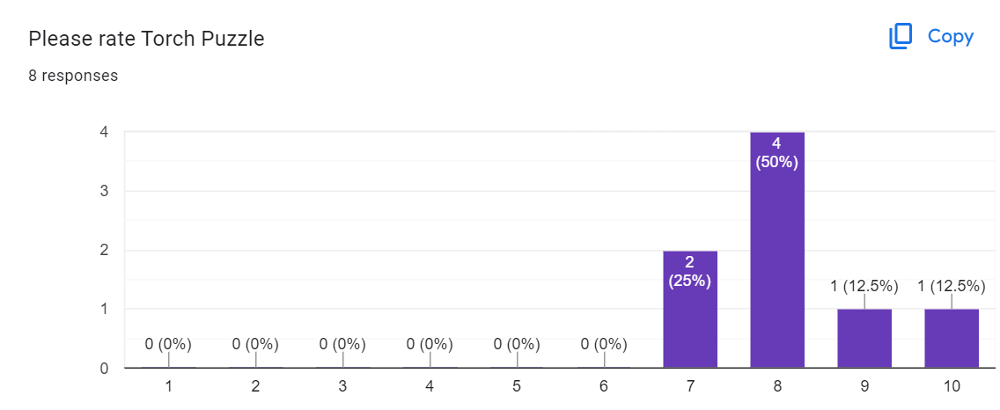
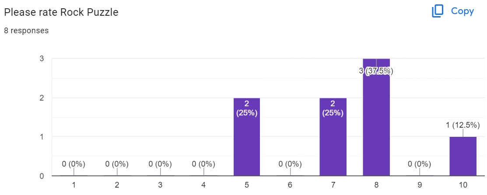

# Project 2 Report

Read the [project 2
specification](https://github.com/COMP30019/Project-2-Specification) for
details on what needs to be covered here. You may modify this template as you see fit, but please
keep the same general structure and headings.

Remember that you must also continue to maintain the Game Design Document (GDD)
in the `GDD.md` file (as discussed in the specification). We've provided a
placeholder for it [here](GDD.md).

## Table of Contents

* [Evaluation Plan](#evaluation-plan)
* [Evaluation Report](#evaluation-report)
* [Shaders and Special Effects](#shaders-and-special-effects)
* [Summary of Contributions](#summary-of-contributions)
* [References and External Resources](#references-and-external-resources)

## Evaluation Plan

-**Evaluation Techniques:** Post-task walkthrough (obeservational method) and questionnaire (querying technique) are chosen to evaluate the game. Testers will be asked to complete the whole game and the interview will be taken after the testers finish their gameplay. Post-task walkthrough is chosen because hints are given in the game so players are expected to complete the game by themselves, which means no advice or hints should be given to help them finish the game. Also, as for the horror game, players' experience will be greatly affected if they are allowed to communicate with developers. The questionnaire was chosen because we can get detailed feedback not only about the game but also information about players. Information about players can be used to analyze how different players' feedback can contribute to our further development.

-**Participants:** The targeted participants (>10) will be peers with interests in horror games with moderate PC game experience. Participants will be mainly chosen from our friends. They need to know the most common PC game control mechanism. They will be accessed depending on their experiences in games including which games they have played and their expertise in those games.

-**Data Collection:** The whole process of testing will be recorded by camera and screen recording to record all actions that players take during the gameplay section. We will sit beside the tester and every issue that the player encounters will be taken down by paper and pencil. Some game testers will be required to fill in the Google Forms and respond to questions about different parts of the game. Questions include questions about basic personal information, testers' game experience, graphics, controls and sound effects of the game, etc. In that way, gameplay metrics (Session duration, Levels or stages completed, Player choices or paths taken), user behaviors, user feedback, and technical data will be collected. All data will be recorded by voice and screen recorder, pen and paper, and Google Forms.

-**Data Analysis:** Metrics including session length, level failure rate, bug reports, and average time spent on each puzzle will be analyzed for improvement. Also, recordings of gameplay will be watched to observe players' behaviors for unexpected behaviors that players will make and how they will influence the game logic and gameplay experience. Issues observed during gameplay and answers to interview questions about testers' experience will be grouped and categorized for analysis of optimizable game components. Commonly reported issues provide the basis of high priority for further improvements and other subtle issues can be considered for optimization. 

-**Timeline:**Game evaluations will be completed before October 12th. Team members will collect and analyze data from evaluations and analyze feedback according to analysis metrics in two days after October 12th. A meeting will be held to discuss how to refine the game mechanism, graphics, and sound effects of the game. Ongoing game evaluations will be performed to get feedback on changes to the game. Before the final submission improvements will be made based on feedback and other details including graphics, sound effects, hints, etc. will be implemented.

| Due Date       | Action                                        |
| -------------- | --------------------------------------------- |
| October 10     | Test Participants Selection                   |
| October 13     | First Round Testing and Feedback              |
| October 14     | Feedback Gathering and Analysis               |
| October 19     | Refine the game based on first round feedback |
| October 20     | Implment game music and graphics              |
| October 20     | Second Round Testing and feedback             |
| October 22     | Feedback collection and Analysis              |
| October 28     | Final review of our game and bug fixing       |
| October 30     | Publish the final version of the game         |

-**Responsibilities:** Two or three team members will be responsible for refining the game mechanism and the rest of the team will keep implementing text content, graphics, and sound effects of the game. The number of team members for polishing the game mechanism depends on the workload from feedback. The individual workload will be estimated and discussed during the meeting after every feedback is received, and it will be agreed upon by all team members to ensure equal contribution.
## Evaluation Report

-**Evaluation Attendees:**
A total of 13 individuals participated in the evaluation process, all of whom were selected from our circle of friends. We employed a post-task walkthrough as our observational method for 5 participants, while the remaining 8 completed a questionnaire designed to probe their insights. Detailed observations from the gameplay will be covered in the subsequent section.

Regarding the demographics of those who completed the questionnaire, there was an even gender distribution. Notably, three-quarters of the participants play games more than once a week, with MOBA and RPG genres emerging as their top preferences. A significant majority placed high importance on graphics and visuals, followed closely by the game's storyline and plot. Additionally, six out of the eight participants primarily use a PC for their gaming experiences.

By analyzing the gathered information, we've gained a clearer perspective on how tester feedback can shape our ongoing development. To start, given that a majority of our testers often play games weekly on PCs, it's likely they're well-acquainted with control mechanics. Thus, their insights will likely lean more toward the nuances of game control mechanics rather than basic instructional feedback. Next, considering that graphics and storyline emerged as pivotal game elements for most testers, we can anticipate substantial feedback on these aspects. Lastly, with only one respondent expressing a preference for horror-themed games, we expect the feedback to encompass a broader spectrum, not limited strictly to our game's theme. Aspects like general playability, sound effects, visuals, controls, and puzzle complexity will be at the forefront of our consideration.

-**Observations:** Our primary observational method is the post-task walkthrough. We documented the reactions, unexpected behaviors, and challenges faced by five evaluation participants during gameplay. Utilizing traditional pen and paper for note-taking, we also video-captured certain player behaviors. Here are our findings:

The first issue is about instruction, including instructions on player control mechanics, props, maps, and current positions of the player. We have placed the tasks that need to be done in dialogues and a notebook that contains all necessary information in the form of diaries, but we noticed that there was no player reading the text-based content of the game. Their gameplay habits were going straight into the game and then looking for instructions on the screen. If there was no obvious hint or instruction, they tended to look at the map and go to the locations that they thought might be right. There were two players reporting that they could roughly understand the map, but they could not tell where they were by looking at the map and gameplay screen. Those who could fully understand the map, most of them got lost in the forest as we have hidden hints in the forest. Also, if they went to the rock puzzle at first, then they may have no clue whether they solved the puzzle correctly or not because they don't know what will happen if they successfully tackle the puzzles. Another issue about the instruction is that they don't know how to use consumable props and what they are used for. Most of them finished the game without using props even once. Our tutor also reports the same issue. He told us that even with a sophisticated game experience, he usually had no idea of some functionalities of our game.

The second issue observed from the evaluation is that the difficulties of the three puzzles are not evenly distributed. Two players had an issue understanding the hint for the rock puzzle. It was easily misunderstood because in our design the hint was not given in an intuitive way, but most players would interpret it in an intuitive way. Except for the shapes and locations in the hint, they might overlook the colors and positions of some dots in the hint. It took them more than two minutes to understand the hint, while the time limit of our game is five minutes. Another player met an issue when he was in the island puzzle. There were several numbers on the paper of the hint, but the player could not find the correlations between the numbers and the names of the portals. After entering the puzzle, he also lost his way into the island puzzle once he stepped into the wrong portal due to insufficient indication of which island he was on. The difference between the difficulties of the three puzzles might lead to frustration for players.

The last major issue we observed is that players might feel stressed dealing with enemies. In our settings, the speeds of players and enemies should be relatively the same to create a sense of tension. The actual situation is different from our expectations. Because about three players didn't know how to use props or didn't know the accelerate mechanic, they felt stressed on the way to puzzles as enemies would chase players when the players got positioned within a preset range of enemies. The results were that they usually failed at escaping from attacks of enemies as they didn't know those helpful skills.

-**Feedback From Questionnaires:** 
Eight testers were invited to share their insights and perspectives by completing a detailed questionnaire about our game. We sought evaluations on various game elements including graphics, sound effects, control mechanics, storyline, map, instructions, and three specific puzzles, all on a scale from 1 to 10. Additionally, we included optional queries to glean more nuanced feedback for potential enhancements in each category.

Six of the testers awarded a score of 8 to both the User Interface (UI) and graphics. A minor issue was identified in the UI regarding the font size, suggesting an adjustment to a larger scale for improved clarity and readability. Aside from this, the general consensus deemed the UI and graphics satisfactory. The majority of ratings hovered around the 8-mark, with a particular call for an expansion in sound effects and background music. Two testers highlighted the potential for enhanced engagement and interactivity through the implementation of responsive sound effects, correlating with player actions and changes in the game environment.

Control mechanics saw a slight drop in ratings, averaging one point less than sound effects. Issues like lag and collision detection were raised. Both the control and map systems received an average rating of 7.

Instructions emerged as the lowest-rated and most commented-upon aspect of the game. Our position as developers grants us a thorough understanding of the game's controls and puzzles, a familiarity not necessarily shared by our testers. Consequently, we probed deeper into the instruction component, which, as anticipated, garnered extensive feedback. The instructions averaged a score of 6 out of 10. Puzzles, props, and map navigation were pinpointed as areas in dire need of clearer guidance.

Tester feedback underscored a demand for additional instructions on basic control mechanics, ranging from map access, consumable prop utilization, and diary page navigation, to running techniques. Moreover, they requested more explicit directions concerning the character's current location, hint placements within the forest, and a persistent on-screen display of remaining tasks. An insightful suggestion also emerged regarding the inclusion of enemy information within the game, an aspect previously overlooked by our team.

The rock puzzle was distinguished as the least favored among the three puzzles. Feedback revealed that testers encountered issues with the rock potentially becoming lodged in a narrow space between a torch and a wall, rendering it immovable. Aside from this specific critique, no additional gameplay issues were reported by the testers.

-**Evaluations:** From the observations we had during the testers' gameplay and answers to questionnaires we received, we can clearly see the differences in results obtained from the observational method and querying method. From observations, the lack of instructions, the difficulties of three puzzles, and the pressure to finish the game within the time limit while preventing themselves from attacks of enemies, but from the questionnaire, we didn't receive many responses on the same issues. The main issues of the game reported by testers in questionnaires are the lack of instructions and improvements in sound effects.

Combining the results of the post-task walkthrough, we can see some significant issues that greatly affect players' game experience. The first issue is that insufficient instructions lead to a significant negative influence on the game experience. From our observations and feedback from the questionnaire, testers might struggle with maps, puzzles, props, player controls, and enemies. Although we have put hints in the text-based prop and dialogues, players might miss those hints because most of them didn't read the text in the game. Also, some control mechanics similar to other RPG games, like press shift to run and press f to use props, are not familiar to those testers, which was an unexpected situation before testing. The indications of positions should be more clarified. During tests, almost all testers could not understand the map. For further development, instructions on all elements should be included and shown in a straightforward way. We decided to rearrange the ways of showing our instructions. Instructions on control mechanics should be shown on the gameplay screen as many as possible to make sure that players know control mechanics whenever they need to. For example, there will be a sentence "press shift to run" above the stamina bar. Important instructions of the game process will be shown as a part of the transition animation. A piece of animation will be played to inform players that they are chased by devils and need to find three gems once they enter the middle part of the map. Hints of three puzzles will be moved from camps in the forest to positions close to corresponding puzzles. Full instructions on player controls will be placed on the help page. By doing this, there should be enough instructions for players to finish the game successfully.

Another important necessary change to the game that should made is that the difficulty of the game should be reduced to an acceptable level to ensure players are able to finish the game in a few runs. Difficulties of the game come from two parts: one is the hint to rock puzzle is not given in a straightforward way, and the other one is devils' moving speeds are too fast for players to escape from the attacks of devils. Although we indicated the correct positions of rocks in rock puzzles by the colors of torches, it still seemed not intuitive enough because no players would have thought about why the colors of dots, which represent torches in the game, are different. And because of the lack of indication of a failure in complementing this part, players might not be able to know if they got it done correctly or not. Also, on the way from one puzzle to another, there might be devils on the path. Six of the players were unable to escape from attacks because they could not utilize their stamina and props very well. In this case, the difficulty should be reduced by making the hint more intuitive and preventing devils from being too powerful. We need to redraw the graph of the rock puzzle hint to make the positions of shapes correspond to the actuall positions of shapes in the game. In this way, the rock puzzle will not take a long time to be tackled. Also, we reduce the speeds of devils so that players will not be caught up by devils so easily. 

Minor problems were mainly collected by questionnaires. Two testers mentioned that we need sound effects to be more responsive to players' behaviors and game processes. Also, the font size should be replaced with a more visually clear one. The collision detection should be refined as well. One player mentioned that in the rock puzzle if a rock is pushed to the corner between a torch and the wall, the rock will be stuck. In the forest, players can sometimes pass a tree, which looks abnormal. These minor issues won't affect players' experience greatly and they can be fixed by adjusting some parameters of corresponding elements. 

-**Final Results:**
After gathering and analyzing feedback from our testers, we have identified key areas of our game in need of enhancement and developed strategies for implementation. Our primary focus has been on enriching the game’s instructional content and refining the puzzles to enhance user experience.

We rearranged the layout of the UI and added instructions to some elements to simplify the actions of searching player control instructions. The drawing of the map has been redrawn according to the changes in the actual map. Camps with instructions for each puzzle have been moved next to the corresponding puzzle, and the start point has been labeled on the map in case players lose their way at the start. The instruction of player controls has been moved to a place that is easier to access. Full descriptions of props are also added in the inventory interface. Players should get a better understanding of game mechanics and player controls. Also, we change the presentation of clues in a more intuitive way. Shapes in the hint map to actual shapes on the ground in the rock puzzle, and the size of the collider box of walls and torches in the rock puzzle has been changed, so the rock won't be stuck in the wall while being pushed. Speeds of devils were reduced to create more space for players to escape. These changes will shorten the time that players spend on this puzzle, decrease the possibility of failure, and improve the game experience. 

Furthermore, we polished our graphics and sound effects to make the game more engaging. More than twenty sound effects and BGM have been introduced into the game, and each one will respond to one event. Most actions will be paired with a sound effect. UI and environment were polished by the usage of new models, particle systems, and shaders. For example, the ritual field is polished by an old clock with a particle system around it, delivering a mysterious feeling. The logic of props storage interactions has been simplified. The process of opening the backpack, dragging a prop into the inventory bar, closing the backpack, and switching to the item you want to use has been simplified to a prop switch action, which greatly reduces the complexity of interactions. Font size, and colors of important messages in dialogues were changed to a more visually clear style. Important messages were highlighted in red in the dialogues, as well as text in the diary. Also, the content in the diary was enriched. Except for the background story, information about tasks, descriptions of three puzzles and devils, and information about the forest were also introduced into the diary. 

After collecting data from testers, evaluating feedback, determining the development plan, and implementing planned changes, the game was improved from the version without sufficient instructions, the balance between the difficulties of three puzzles, enough time and space for players to escape from attack and engaging graphics and music to the version with complete instructions of the map, control mechanics and puzzles, well-arranged map, interesting puzzles with reasonable difficulties, responsive sound effects and music, and player-friendly UI designs. During the final stage of development, we will focus on testing, fixing minor bugs, and polishing the game experience by balancing the time limit, power of the protagonist, pressure from enemies, and difficulties of three puzzles.

## Shaders and Special Effects

  1. Background Blurring Shader: This is a custom Unity Shader designed to achieve a blurring effect. Specifically, it applies blur twice: once horizontally and once vertically. Let me break down the main parts of this Shader for you.
Properties:
_MainTex: The primary texture, typically for sprites or UI elements. _Color: The main color. _Size: Defines the size of the blur. _DecayFactor: Decay factor used to control the intensity of the blur.
SubShader: This shader consists of two main sections: horizontal blur and vertical blur.
Horizontal Blur: Uses GrabPass to capture the contents of the current render target. This allows us to sample it in the subsequent Pass.
Within the Pass, the primary function is frag, which computes the blurring effect.
To achieve the blurring effect, this function samples multiple pixels around the current one and assigns them different weights. These samples are weighted based on their distance from the center, with pixels further from the center having a lower weight. The original image and the blurred image are linearly interpolated using _DecayFactor to achieve the final blurred effect.
Vertical Blur: Similar to horizontal blur, but the sampling is in the vertical direction.
Again, it samples pixels around and gives them weights for a composite blend.
The original image and the blurred image are linearly interpolated using _DecayFactor to produce the final blurred effect. In both the blurs, there's a conditional check if (i.uvgrab.x == 0 && i.uvgrab.y == 0) which sets _DecayFactor to 0 when the UV coordinates are at (0,0). This seems to be handling some specific edge case, but its exact purpose isn't clear from this code.
In summary, this Shader is created for Unity, aimed at adding a bidirectional blur effect in screen space for UI elements or any other render target. It first does a horizontal blur followed by a vertical blur to result in a more uniformly blurred effect.

Path to Blurring Shader: [Blurred Panel Shader](Assets/Shader/BlurPanel.shader)

Before Blurring:

After Blurring:

  2. Dissolve shader: We designed a costomised shader which implementing the dissolve effect. The shader takes DissolveTexture and EdgeWidth as arguments to determine the dissolving pattern of the material and the transition between the dissolved part and the remaining part.The dissolve processing is controlled by a C# script called DissolveController. The control access a property in the shder called DissolveThreshold. The whole process is that in the fregment shader, the R value of the pixel is firstly get from the dissolve texture through tex2D function based on their uv coordinate, called dissolve value. Then it is checked by the clip function, and if the dissolve value is smaller than the dissolve threshole, it is discard by the clip function so it will visually disappear. Then, if the pixel with its dissolve value servive the clip function, it is passed into a smoothstep function to check how if the color is within the dissolving transition area based on the EdgeWidth. If the dissolve value falls bwtween the DissolveThreshold and DissolveThreshold + EdgeWidth, an value called edge is calculated using smoothstep function to describe how far is it from being dissolved. Based on this edge value, the final color of the pixel is determined by a lerf function, which linear interpolate the color based on the edge color, the color from the original texture, and the edge value which specify how far is it from being dissolved. If the dissolve value is greater than DissolveThreshold + EdgeWidth, the original color from the original texture is kept. The dissolve effect is achieved by keep increasing the DissolveThreshold by the script.

Path to Blurring Shader: [Dissolve Shader](Assets/Shader/Dissolve.shader)

Dissolving Effect:

-**Special Effect：**

  1. Frozen Effect: We designed a frozen effect for the prop called Saint Salt. When the saint salt gets scattered by players, there will be a fan-shaped area with some white round-shaped particles and the enemies within this area will be frozen. A frozen effect will be generated on the devil's body. The frozen effect is made up of two-particle systems: ice and small blue dots. The ice particle system is generated by rotating a picture of a snowflake several times around the center of devils for random direction, simulating frozen effects. The edge transparency of the ice is set to a low value to avoid inconsistency of graphics. Small blue dots are designed to fall around the ice particle system to simulate a snowy scene. Two particle systems will be generated at the same time once the saint salt hits enemies.

The frozen effect has 4 parts

Ice: The main Ice part
-  Use a ice image as the particle texture
-  Randomly rotate the image when generate each of the image
-  8 bursts and each burst will generate 1 - 3 ices, each burst's time gap is 0.03s

Ice Spark: The sparkles that emit from the ice
-  Play with gravity
-  Use a star image as the particle texture, shrink the size.
-  8 bursts and each burst will generate 2 - 5 sparks, time gap is 0.03s

Ice Drop: The ice drops that shows like the snow falling down
-  Play with gravity
-  Use a snow image as the particle texture, shrink the size
-  The drop generate with the time, each second will generate 8 drops
-  Each drop will getting smaller with it's life time

Air Emit: The smoke & icy air that emit from the ice
-  Use a smoke image as the particle texture, this is a 2*2 image matrix, so texture will be one of them randomly
-  The shooting direction is a random direction in the unit circle
-  10 bursts and each burst will generate 12 - 20 smokes, time gap is 0.3s
-  Each smoke will keep rotate with it's life time

Path to Forzen Particle System: [Frozen Effect](Assets/Prefabs/ParticleSystem/Freeze.prefab)

  2. Magic Field Effect: At the center of the forest, there is a magic field with an old clock floating in the air. Four particle systems are involved in this effect. The magic field is built up with three magic spots and one red magic circle with two distinct particle systems. Also, the floating and orbiting circles around the old clock are generated by the other two particle systems. All these particle systems are created when the game starts, and they will move as time changes.
This paricle system consists of two parts. The orbit effect: the velosity of time section is changed to add randomness to the pariticle system. In more detail, The orbital speed is set to be random between two constants. The shape is change to sphere and color over time is set to refine the effect. Lastly, the trail section is enabled and the max paricle size in render section is changed to zero so that only the trail is visible. The gathering effect: it is very similar except the radial force is enabled, the orbital velosity is disabled the there is no trail section.

Path to Magic Field Particle System: [clockParticles](Assets/Prefabs/ParticleSystem/clockParticals.prefab)
                                     [clockTrails](Assets/Prefabs/ParticleSystem/clockTrails.prefab)

## Summary of Contributions

### Cheng Chen:

- Game main program & Logic
- Inventory System 
- Portal & Island Puzzle Design
- Timeline System
- Player Control & Animation System  
- Enemy Control & Animation System
- Sound & Audio System
- Diary System
- Pause System
- Additional Animations
- Some Particle System & Shader
  - Water Wave Shader
  - Holy Wall Shader
  - Gem Self float & rotate Shader
  - Background Blur Shader
  - Holy Salt Particle System
  - iced Particle System
  - Holy Wall Particle System
  - Accelerate Particle System
- GitHub maintenance
- Main Debug

### Zheqi Shen

- Game programming & Logic
- Dialogue System
- Flame System
- UIs Design & Implement:
  - Start Page Design & Implement
  - Menu Page Design & Implement
  - Pause Page Design & Implement
  - Game Over Page Design & Implement
- Some Particle System & Design
  - Cential Magic Field Particle System
  - Gem Place Spot Particle System
  - Dissolve Shade
  - Glowing Shader
- Torch puzzle implement
- Rock Puzzle implement
- Protal Puzzle Design
- Game Map Optimization
- Code Debug

### Steven Chen

- Design game's overview, mechanics and player progression
- Writing the skeleton of Background Story
- Finding artistic assets
- Game map construction
- Player accelerate potion's code
- Black panels for dialogue's code
- Design post-processing of the camera
- Writing and continuously maintaining Game Design Document
- Carry Out Game Testing
- Manage Documentation
- Bug Tester

### Yingwang Ng

- Sound Effect and BGM Design
- Rock puzzle Design
- Torch Puzzle Design
- Writing and continuously maintaining Game Design Document
- Design Evaluation Plan
- Testing Game
- Carry Out Game Testing
- Writing Evaluation Report
- Background Story Writing and other text content (Instructions, Dialogue, etc.)
- Manage Documentation

## References and External Resources
- Admurin's Pixel Items: https://assetstore.unity.com/packages/2d/gui/icons/admurin-s-pixel-items-194929
- Antique Clocks Pack: https://assetstore.unity.com/packages/3d/props/interior/antique-clocks-pack-43739
- Dark - Complete Horror UI: https://assetstore.unity.com/packages/2d/gui/dark-complete-horror-ui-200569
- Dreamscape Nature : Meadows : Stylized Open World Environment: https://assetstore.unity.com/packages/3d/environments/fantasy/dreamscape-nature-meadows-stylized-open-world-environment-186894
- Fantasy Horde - Villagers: https://assetstore.unity.com/packages/3d/characters/humanoids/fantasy/fantasy-horde-villagers-3793
- Grunge UI Kit: https://assetstore.unity.com/packages/tools/gui/grunge-ui-kit-53815
- Low Poly Character - Flying Eye - Fantasy RPG: https://assetstore.unity.com/packages/3d/characters/creatures/low-poly-character-flying-eye-fantasy-rpg-175320
- Magic Circles and Shields Vol.3: https://assetstore.unity.com/packages/vfx/particles/spells/magic-circles-and-shields-vol-3-153509
- Magic Gems: https://assetstore.unity.com/packages/3d/environments/fantasy/magic-gems-102763
- Sound Effect and BGM: https://freesound.org/
- Weeper Horror Ghost Pack PBR - Fantasy RPG: https://assetstore.unity.com/packages/3d/characters/creatures/weeper-horror-ghost-pack-pbr-fantasy-rpg-74548
